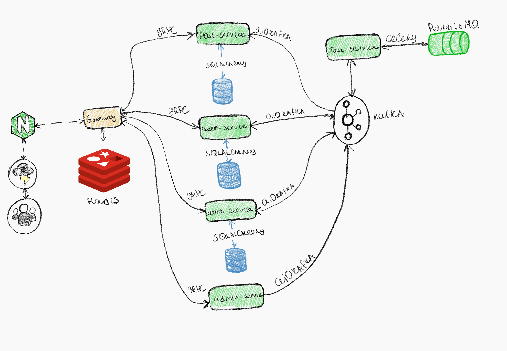

# 🧩 Microservices_Site

Центральный репозиторий микросервисной платформы форума.

Данный репозиторий **не содержит бизнес-логики сервисов**.  
Он описывает:
- общую архитектуру системы;
- состав микросервисов;
- инфраструктуру;
- порядок локального и production-запуска.

Платформа задеплоена и доступна онлайн:  
🔗 https://kload.ru

---

## 🎯 Назначение репозитория

- оркестрация сервисов через Docker Compose;
- конфигурация Nginx и сетевого взаимодействия;
- единая точка входа в систему;
- документация по архитектуре платформы.

Каждый микросервис разрабатывается и версионируется **в отдельном репозитории**.

---

## 🧱 Архитектура

<p align="center">
  
</p>

<p align="center">
  <em>Architecture of the microservices platform</em>
</p>

- микросервисная архитектура;
- отдельная база данных на сервис (database-per-service);
- HTTP-доступ только через API Gateway;
- внутреннее взаимодействие между сервисами через gRPC;
- асинхронные задачи через RabbitMQ + Celery;
- событийная интеграция через Kafka.

---

## 📦 Сервисы платформы

| Сервис        | Назначение                               | Репозиторий |
|--------------|-------------------------------------------|------------|
| Auth Service | Аутентификация, JWT, email-подтверждение | [auth-service](https://github.com/Weit145/auth-service) |
| User Service | Пользовательские профили                 | [user-service](https://github.com/Weit145/user-service) |
| Post Service | Посты и публикации                       | [post-service](https://github.com/Weit145/post-service) |
| Task Service | Асинхронные задачи                       | [task-service](https://github.com/Weit145/task-service) |
| Gateway      | HTTP → gRPC API Gateway                  | [gateway-service](https://github.com/Weit145/gateway) |
| Admin Service| Внутренние админ-задачи                  | [admin-service](https://github.com/Weit145/admin-service) |
| Frontend     | Веб-интерфейс (React)                    | [kload-frontend](https://github.com/colosss/kload-frontend) |

Подробное описание API, бизнес-логики и схем данных находится в README соответствующих сервисов.

---

## 🗄️ Хранилища данных и брокеры

- **PostgreSQL** — отдельный инстанс на каждый сервис;
- **RabbitMQ** — очередь асинхронных задач;
- **Kafka** — брокер событий для событийной интеграции.

---

## 🌐 Точка входа

**Nginx** является единственным публичным компонентом системы и отвечает за:
- терминацию HTTPS;
- проксирование запросов;
- маршрутизацию трафика к frontend и API Gateway.

---

## 🐳 Запуск платформы

### Локально

1. Установите Docker и Docker Compose.
2. Склонируйте данный репозиторий.
3. Запустите платформу:

```bash
docker-compose up -d --build
